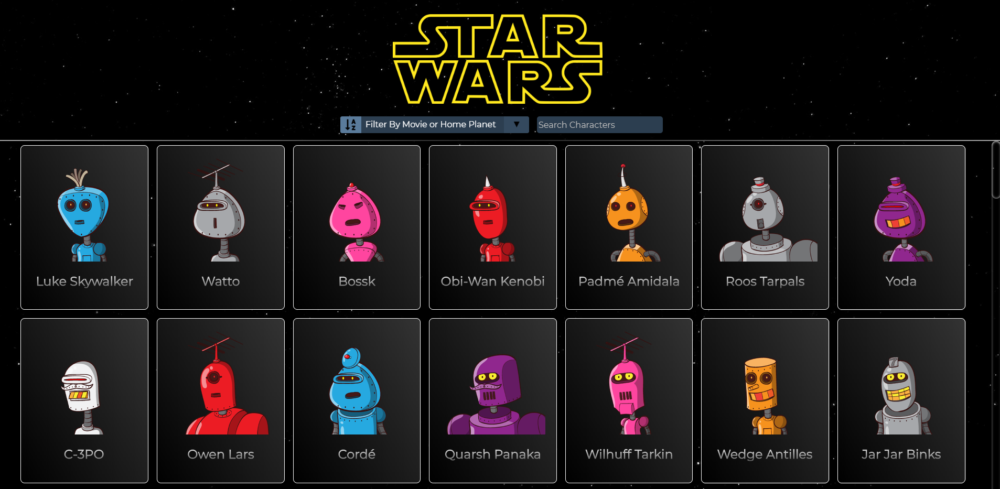
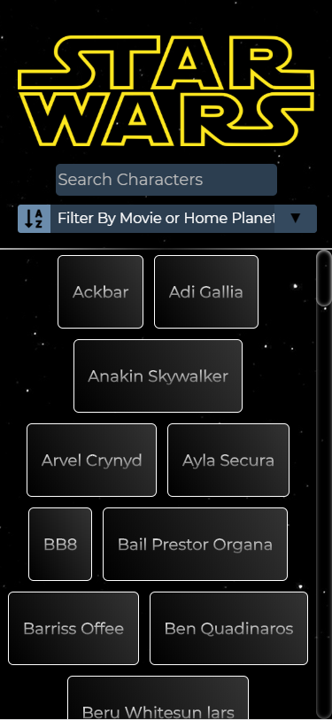
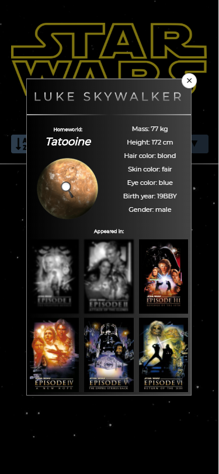

# Star-Wars-Friends

A responsive web app using React that let you filter and search characters in the Star Wars universe and display their data, courtesy of this great [Star Wars API](https://swapi.co/)

## Created Using

- React
- Reactjs-Popup
- HTML, CSS and JS
- Fetch [SWAPI](https://swapi.co/)
- Images from [RoboHash API](https://robohash.org/)

## Online Demo

https://edsonha.github.io/Star-Wars-Friends

  
